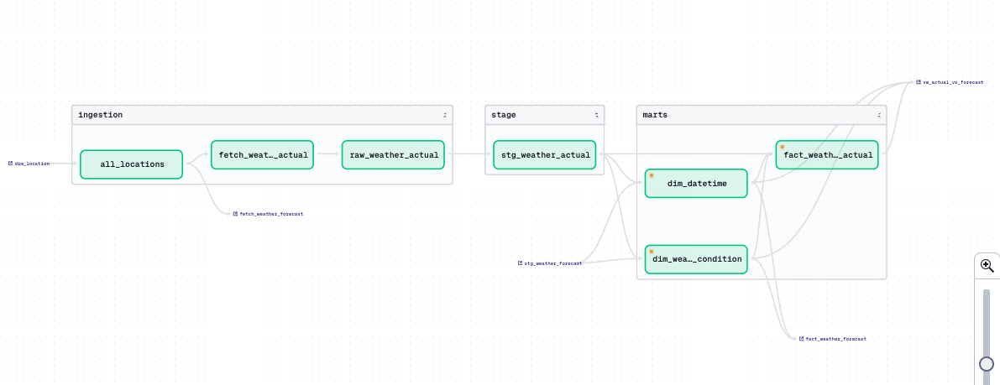
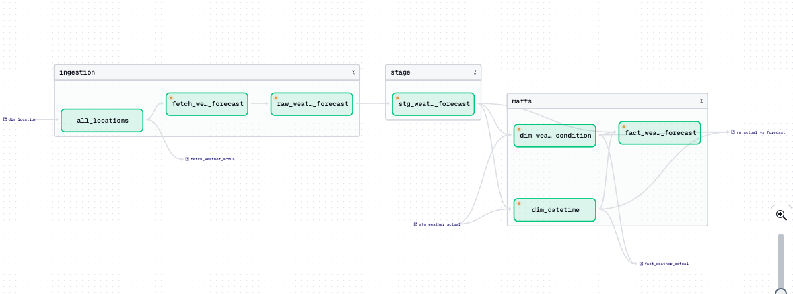
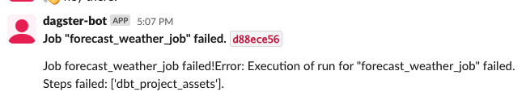

## Overview
We are using dagster to orchestrate the data pipeline, schedule and execute jobs, and manage our data using dagster's software define assets. The dagster project is integrated with my dbt project and utilizes dbt assets for data transformation. 

---
### Assets
Dagster assets are object that are stores in a persistent storage (table, file, etc.). We use dagster assets to represent the data at each state in the pipeline. 

#### Python Assets
**all_locations**
  - Description: This asset fetches all locations from the database.
  - Details: Executes a query to retrieve location data from `public_analytics.dim_location`, which is then used in downstream dependencies to fetch weather data for each location.

**fetch_weather_actual**
  - Description: Fetches actual weather data from the OpenWeatherMap API.
  - Resources: `OpenWeatherMapResource`
  - Details: Interacts with the API to get actual weather data for each location in the `all_locations` asset.

**raw_weather_actual**
  - Description: Loads the raw actual weather data fetched by `fetch_weather_actual` into the database.
  - Resources: `PostgresResource`
  - Details: Inserts the data into the `public_stage.raw_weather_actual` table.

**fetch_weather_forecast**
  - Description: Fetches forecast weather data for the next 5 days in 30 min intervals from the OpenWeatherMap API.
  - Resources: `OpenWeatherMapResource`
  - Details: Interacts with the API to get forecast weather data for each location in the `all_locations` asset.
  
**raw_weather_forecast**
  - Description: Loads the raw forecast weather data fetched by `fetch_weather_forecast` into the database.
  - Resources: `PostgresResource`
  - Details: Inserts the data into the `public_stage.raw_weather_forecast` table.

#### dbt Assets
We use `dbt_assets` decorator and dbt's manifest.json file to create dbt assets in dagster. All dbt models described in [dbt](dbt.md) are represented as assets in dagster. 
We use `CustomDagsterDbtTranslator` to create custom keys and groups for the dbt assets. On materialization we will use `dbt.cli` module to build the dbt models. The upstream depencies of each dbt model is defined in the `source.yml` file of the dbt project.

---
### Resources
Dagster resources are objects that are used to interact with extranal services. In this project we have three resources: `DbtCliResource`, `PostgresResource`, and `OpenWeatherMapResource`. Custom assets ensure scalibility and reusability of the code and provide a clean separation of concerns that helps us manage our project better.

**DbtCliResource**
  - Source: dagster-dbt
  - Function: Interacts with the dbt project to build models and run tests.

**PostgresResource**
  - Source: Custom defined resource
  - Function: Interacts with the PostgreSQL database to run queries and DDL scripts.

**OpenWeatherMapResource**
  - Source: Custom defined resource
  - Function: Interacts with the OpenWeatherMap API to fetch weather data for each location. Monitors the API rate limit and defines retry policies for API downtime, connectivity issues, or rate limit exceeded.

---
### Jobs
Dagster jobs are the main unit of work in dagster. They are used to define the execution logic of the pipeline. We have defined two jobs in this project: `actual_weather_job` and `forecast_weather_job`.

**actual_weather_job**
  - Assets: `all_locations`, `fetch_weather_actual`, `raw_weather_actual`, `dbt_dim_datetime`, `dbt_dim_weather_condition`, `fact_weather_actual`
  - Description:
This job fetches actual weather data for each location, loads the raw data into the database, and runs dbt models to transform the data. The dbt models perform transformation on the raw data and store it in stg_weather_actual and update the dim tables with new dimension data. dbt models will also perform data quality checks on the data.
  - Lineage:
  

**forecast_weather_job**
  - Assets: `all_locations`, `fetch_weather_forecast`, `raw_weather_forecast`, `dbt_dim_datetime`, `dbt_dim_weather_condition`, `fact_weather_forecast`
  - Description:
This job fetches forecast weather data for each location, loads the raw data into the database, and runs dbt models to transform the data. The dbt models perform transformation on the raw data and store it in stg_weather_forecast and update the dim tables with new dimension data. dbt models will also perform data quality checks on the data.
  - Lineage:
  
---
### Schedules
Dagster schedules are used to run jobs at a specific time or interval. We have defined two schedules in this project: `hourly_actual_weather_schedule` and `daily_forecast_weather_schedule`.

**hourly_actual_weather_schedule**
  - Job: `actual_weather_job`
  - Description:
This schedule runs the `actual_weather_job` every hour to fetch actual weather data for each location.

**daily_forecast_weather_schedule**
  - Job: `forecast_weather_job`
  - Description:
This schedule runs the `forecast_weather_job` every day to fetch forecast weather data for each location.

---
### Logging and Monitoring
Each asset or job execution has logs specific to that run. We use each assets context to do additional custom logging during the execution. We also use metadata to log custom informatino about an asset when materialization is complete.

We have integrated slack with dagster to monitor the pipeline. We have defined a `slack_on_run_failure` event handler to send notifications to the `#analytics` channel when a job fails.

---
### Unit Tests
We have defined unit tests for each asset in the pipeline. The tests are defined in `weather_data_pipeline_tests/test_assets.py` and are run using the `pytest` framework. The tests validate the output of each asset and ensure that the data is correct and in the expected format. We are using `mock` and `MagicMock` to mock the resources and assets in the tests.

For our dbt assets we test the data quality seperatly by running `dbt test` command during build execution of each asset. Those tests are defined in the `schema.yml` file of the dbt project.
